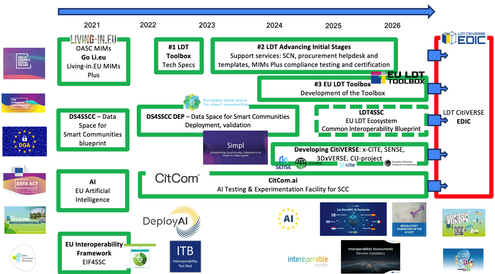
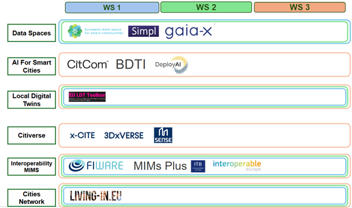

# Smart Communities Ecosystem & Resources

The **LDT4SSC Knowledge Hub Smart Communities Ecosystem** section serves as a gateway to the broader European smart community ecosystem, providing resources and links that connect the project with complementary initiatives.  

It builds upon and leverages established efforts in the fields of **data spaces, AI for smart cities, Local Digital Twins, and the emerging Citiverse**.  
By aligning with these initiatives, LDT4SSC fosters the deployment of interoperable local digital twins and AI services that are both technically robust and compliant with the European regulatory and policy framework.  

In this page, we have categorised the relevant ecosystems into **six thematic clusters**, offering pilots both guidance and concrete tools to better align their activities with the LDT4SSC framework:  

- **Data Spaces** – European data space initiatives supporting secure, sovereign, and interoperable data exchange for smart communities.  
- **AI for Smart Cities** – Initiatives and projects enabling the deployment of trustworthy, human-centred, and interoperable AI services.  
- **Local Digital Twins (LDTs)** – European efforts around the design, deployment, and integration of local digital twins, including standards, toolboxes, and best practices.  
- **Citiverse** – The emerging initiative connecting Local Digital Twins across Europe towards a networked European CitiVERSE.  
- **Interoperability & MIMs** – Frameworks, Minimal Interoperability Mechanisms (MIMs), and technical specifications that ensure cross-domain interoperability and seamless integration of digital services in cities.  
- **Cities Network and Supporting Actions** – Local and regional authorities, cities, peer-to-peer networks, and capacity-building initiatives that promote collaboration, knowledge exchange, and joint actions among European cities.  

<!--  -->

Ultimately, LDT4SSC takes input from all these initiatives, which together converge towards the **European Digital Infrastructure Consortium (EDIC)** framework — a legal and governance instrument enabling multi-country projects with transformative impact on cities and communities across Europe.  

## Related Initiatives & Resources

-   :material-database:{ .lg .middle } __Data Spaces__  

    European data space initiatives supporting secure, sovereign, and interoperable data exchange for smart communities.  

    [:octicons-arrow-right-24: View Details](communities_content/Data_Spaces_Related_Initiatives.md)

-   :material-robot-excited:{ .lg .middle } __AI for Smart Cities__  

    Initiatives and projects enabling the deployment of trustworthy, human-centred, and interoperable AI services.  

    [:octicons-arrow-right-24: View Details](communities_content/AI_For_Smart_Cities_Related_Initiatives.md)

-   :material-city-variant-outline:{ .lg .middle } __Local Digital Twins (LDTs)__  

    European efforts around the design, deployment, and integration of local digital twins, including standards, toolboxes, and best practices.  

    [:octicons-arrow-right-24: View Details](communities_content/Local_Digital_Twins_Related_Initiatives.md)

-   :material-earth:{ .lg .middle } __CitiVERSE__  
 
    The emerging initiative connecting Local Digital Twins across Europe towards a networked European CitiVERSE.  

    [:octicons-arrow-right-24: View Details](communities_content/CitiVerse_Related_Initiatives.md)

-   :material-lan:{ .lg .middle } __Interoperability & MIMs__  
 
    Frameworks, Minimal Interoperability Mechanisms (MIMs), and technical specifications ensuring cross-domain interoperability.  

    [:octicons-arrow-right-24: View Details](communities_content/Interoperability_and_MIMs_Related_Initiatives.md)

-   :material-city:{ .lg .middle } __Cities Network & Supporting Actions__  

    Local and Regional Authorities, peer-to-peer networks, and capacity-building initiatives promoting collaboration and knowledge exchange.  

    [:octicons-arrow-right-24: View Details](communities_content/Cities_Network_Related_Initiatives.md)

