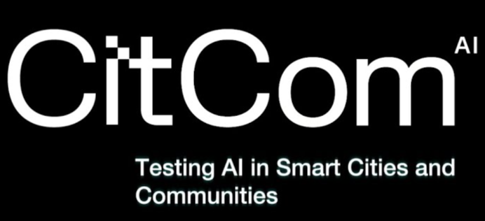

**Artificial Intelligence** is a critical enabler for smart cities, powering decision support, predictive analytics, and adaptive services for citizens and infrastructure. In the LDT4SCC context, AI initiatives provide the intelligence layer that enhances the usability and impact of local digital twins, ensuring they can support real-time monitoring, planning, and policy evaluation.
Some initiatives that are useful and are related to LDT4SCC and can provide important information and resources are:

---

## CitCom.ai (CitComTEF)

{ width="200" align="center" }
--- 
  
**Short Description:** As part of the [EU strategy for safe AI adoption](https://digital-strategy.ec.europa.eu/en/policies/testing-and-experimentation-facilities), CitCom.ai (also referred to as CitComTEF) is a large-scale EU-funded project — a Testing and Experimentation Facility (TEF)— specifically tailored for AI and robotics in the domains of Smart Cities and Communities. It enables AI innovators, including SMEs and startups, to test and validate both software and hardware solutions in real environments before they’re deployed in urban settings.   At the same time, it allows cities to have a reference initiative when adopting data, AI, and Local Digital Twin (LDT) solutions, building upon relevant use-cases and having access to validated solutions from the AI innovators community.  
  
**Key role in the LDT Ecosystem:** CitCom.ai serves as a reference Testing and Experimentation Facility (TEF), supporting the safe, ethical, regulation-compliant, and interoperable deployment of AI in cities. It connects AI testing environments with Local Digital Twins (LDTs), providing a bridge between innovation and real-world deployment.   Within the LDT ecosystem, CitCom.ai acts as a key validation step for AI innovators aiming to join the marketplace of the [EU LDT Toolbox](https://living-in.eu/toolbox), ensuring successful and scalable integration into urban digital twins.  

**Relevance to LDT4SSC:**  
The initiative contributes directly to LDT4SSC by:  

- Supplying a [catalogue of AI Testing and Experimentation services](https://citcomtef.eu/services) relevant for smart communities.  

- Benchmarking AI and robotics market trends in the smart city domain ([Market report](https://citcomtef.eu/assets/uploads/Resources/D5.1-CitCom.ai-European-AI-Market-Report.pdf)), helping pilots and stakeholders align their solutions with market and regulatory needs.  

- Providing Testing and Experimentation Facilities ([TEFs](https://citcomai-hub.github.io/tef/)) where LDT pilots can test innovative services in realistic environments, ensuring scalability, replicability, and compliance with European policies and sustainability goals.  

- Offering a [reference common infrastructure](https://citcomai-hub.github.io/) supporting project operations across the technical domains of data spaces, data analytics, AI modelling, Local Digital Twins, and cybersecurity.  

**Key Assets and Resources:** 
[[catalogue of AI Testing and Experimentation services](https://citcomtef.eu/services), [Market report](https://citcomtef.eu/assets/uploads/Resources/D5.1-CitCom.ai-European-AI-Market-Report.pdf), [TEFs](https://citcomai-hub.github.io/tef/), [reference common infrastructure](https://citcomai-hub.github.io/) ]

**Webpage / Reference Link:**  
[https://www.citcom.ai](https://www.citcom.ai) 

**Main contact point:**  
- Tamara De Swert (IMEC)  
- German Castignani (LIST)  