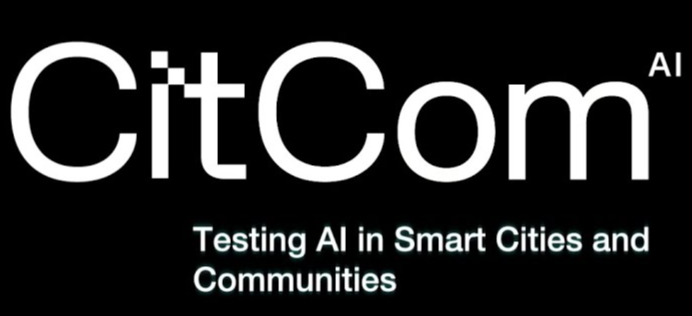

**Artificial Intelligence** is a critical enabler for smart cities, powering decision support, predictive analytics, and adaptive services for citizens and infrastructure. In the LDT4SCC context, AI initiatives provide the intelligence layer that enhances the usability and impact of local digital twins, ensuring they can support real-time monitoring, planning, and policy evaluation.
Some initiatives that are useful and are related to LDT4SCC and can provide important information and resources are:

---

## CitCom.ai (CitComTEF)

{ width="200" align="center" }
--- 
  
**Short Description:** As part of the [EU strategy for safe AI adoption](https://digital-strategy.ec.europa.eu/en/policies/testing-and-experimentation-facilities), CitCom.ai (also referred to as CitComTEF) is a large-scale EU-funded project — a Testing and Experimentation Facility (TEF)— specifically tailored for AI and robotics in the domains of Smart Cities and Communities. It enables AI innovators, including SMEs and startups, to test and validate both software and hardware solutions in real environments before they’re deployed in urban settings.   At the same time, it allows cities to have a reference initiative when adopting data, AI, and Local Digital Twin (LDT) solutions, building upon relevant use-cases and having access to validated solutions from the AI innovators community.  
  
**Key role in the LDT Ecosystem:** CitCom.ai serves as a reference Testing and Experimentation Facility (TEF), supporting the safe, ethical, regulation-compliant, and interoperable deployment of AI in cities. It connects AI testing environments with Local Digital Twins (LDTs), providing a bridge between innovation and real-world deployment.   Within the LDT ecosystem, CitCom.ai acts as a key validation step for AI innovators aiming to join the marketplace of the [EU LDT Toolbox](https://living-in.eu/toolbox), ensuring successful and scalable integration into urban digital twins.  

**Relevance to LDT4SSC:**  
The initiative may contribute directly to LDT4SSC by:  
- Supplying a [catalogue of AI Testing and Experimentation services](https://citcomtef.eu/services) relevant for smart communities.  
- Benchmarking AI and robotics market trends in the smart city domain ([Market report](https://citcomtef.eu/assets/uploads/Resources/D5.1-CitCom.ai-European-AI-Market-Report.pdf)), helping pilots and stakeholders align their solutions with market and regulatory needs.  
- Providing Testing and Experimentation Facilities ([TEFs](https://citcomai-hub.github.io/tef/)) where LDT pilots can test innovative services in realistic environments, ensuring scalability, replicability, and compliance with European policies and sustainability goals.  
- Offering a [reference common infrastructure](https://citcomai-hub.github.io/) supporting project operations across the technical domains of data spaces, data analytics, AI modelling, Local Digital Twins, and cybersecurity.  

**Key Assets and Resources:** 
[[catalogue of AI Testing and Experimentation services](https://citcomtef.eu/services), [Market report](https://citcomtef.eu/assets/uploads/Resources/D5.1-CitCom.ai-European-AI-Market-Report.pdf), [TEFs](https://citcomai-hub.github.io/tef/), [reference common infrastructure](https://citcomai-hub.github.io/) ]

**Webpage / Reference Link:**  
[https://www.citcom.ai](https://www.citcom.ai) 

**Main contact point:**  
- Tamara De Swert, Project Coordinator: tamara.deswert@imec.be

## Big Data Test Infrastructure (BDTI) – European Commission  

{ width="230" align="center" }  
---  

**Short Description:**  
The Big Data Test Infrastructure (BDTI) is a European Commission initiative designed to provide testing, validation, and benchmarking for big data technologies, platforms, and applications. It supports Local Digital Twins (LDTs), smart cities, and data spaces by offering scalable, secure, and interoperable testing environments. BDTI aligns with EU policies such as the Digital Europe Programme, Horizon Europe, and the Data Governance Act, and enables public administrations, businesses, and researchers to validate big data solutions in compliance with EU standards (e.g., Gaia-X, FIWARE, NGSI-LD). It is complemented by training, certification, and community engagement programmes, and validates its strategies through pilot projects in European cities and regions, engaging public administrations, SMEs, and research organisations.  

**Key role in the LDT Ecosystem:**  
BDTI plays a critical role in the LDT ecosystem by providing a testing and validation framework for big data technologies. It ensures compliance, scalability, and interoperability of LDT deployments, and supports cross-sector collaboration (e.g., mobility, energy, environment) through standardized testing environments. By aligning with EU policies (e.g., Digital Decade 2030, Data Governance Act), it builds legal compliance and trust into LDT projects while also facilitating innovation and funding by connecting projects to European programmes.  

**Relevance to LDT4SSC:**  
The initiative may contribute directly to LDT4SSC by:  
- Providing a testing and validation framework for big data in LDTs, ensuring interoperability and compliance.  
- Supporting cross-domain collaborationvacross mobility, energy, and environment sectors.  
- Ensuring compliance with EU regulations (e.g., GDPR, Data Governance Act), reducing risks for cities and communities.  
- Facilitating innovation and scalability by linking LDT pilots with EU programmes (Horizon Europe, Digital Europe).  

**Key Assets and Resources:**  
[[BDTI Policy Overview](https://digital-strategy.ec.europa.eu/en/policies/bdti), [BDTI Knowledge Base](https://living-in.eu/knowledge-base bdti-big-data-test-infrastructure-european-public-administrations), [BDTI Github](https://code.europa.eu/bdti)]  

**Webpage / Reference Link:**  
[https://digital-strategy.ec.europa.eu/en/policies/bdti](https://digital-strategy.ec.europa.eu/en/policies/bdti)  

**Main contact point:**  
- Maria Claudia Bodino, BTDI project officer: mariaclaudia.bodino@ec.europa.eu

## deployAI - AI Deployment Platform for Smart Cities and Local Digital Twins

{ width="230" align="center" }  
---

**Short Description:**  
deployAI ( AI Deployment Platform for Smart Cities and Local Digital Twins) is an AI deployment platform designed to simplify the integration of artificial intelligence into smart city applications and Local Digital Twins (LDTs). It provides tools, frameworks, and best practices for deploying, managing, and scaling AI models in urban environments—enabling data-driven decision-making, automation, and predictive analytics. deployAI aligns with EU policies (e.g., AI Act, Digital Decade 2030) and supports interoperability with EU data spaces and standards (e.g., Gaia-X**, FIWARE, NGSI-LD). It accelerates AI adoption by offering ready-to-use components, ensuring regulatory compliance (AI Act, GDPR), and fostering collaboration across public administrations, businesses, and researchers through training, certification, community engagement, and pilot projects in European cities (e.g., Barcelona, Helsinki, Amsterdam).

**Key role in the LDT Ecosystem:**  
deployAI plays a critical role in the LDT ecosystem by:  
- Providing AI deployment tools for real-time analytics, automation, and predictive modelling in LDTs.  
- Ensuring compliance with EU AI regulations (AI Act, GDPR), reducing legal and operational risks.  
- Supporting cross-domain use cases (mobility, energy, environment) via AI-driven insights.  
- Facilitating interoperability with EU data spaces and standards (Gaia-X, FIWARE, NGSI-LD) to enable scalable, replicable LDT deployments.  

**Relevance to LDT4SSC:**  
The initiative may contribute directly to LDT4SSC by:  
- AI Deployment Tools: Ready-to-use frameworks for deploying AI models in LDTs, enabling real-time analytics and automation.  
- Compliance with EU Regulations: Built-in practices to help ensure conformity with the AI Act, GDPR, and the Data Governance Act.  
- Cross-Domain Use Cases: Supports mobility, energy, and environmental applications for holistic urban planning and sustainability.  
- Interoperability with EU Data Spaces: Integrates with Gaia-X, FIWARE, and NGSI-LD for scalable, portable solutions.  
- Pilot Projects and Use Cases: Provides real-world references (e.g., Barcelona, Helsinki) that LDT4SSC can replicate and scale.  

**Key Assets and Resources:**  
[[EIT News on deployAI](https://www.eit.europa.eu/news-events/news/deployai-brings-ai-demand-platform-market), [EIT Digital newsroom article](https://www.eitdigital.eu/newsroom/news/2024/deployai-brings-the-ai-on-demand-platform-to-the-market-starting-today/), [EU Funding & Tenders project page](https://ec.europa.eu/info/funding-tenders/opportunities/portal/screen/opportunities/projects-details/43152860/101146490/DIGITAL?programmePeriod=2021-2027&programId=43152860&projectId=101146490&order=DESC&page=1&pageSize=10)]  

**Webpage / Reference Link:**  
[https://www.eitdigital.eu/newsroom/news/2024/deployai-brings-the-ai-on-demand-platform-to-the-market-starting-today/](https://www.eitdigital.eu/newsroom/news/2024/deployai-brings-the-ai-on-demand-platform-to-the-market-starting-today/)

**Main contact point:**
- **Federico Guerrini**, Communications Lead I&E at EIT Digital: federico.guerrini@eitdigital.eu

---

## AI4Europe – AI-on-Demand Platform for Europe

{ width="200" align="center" }
---

**Short Description:**
AI4Europe is a 42-month Horizon Europe-funded initiative that manages, develops, and facilitates the AI-on-Demand Platform (AIoD) - a centralised European platform for AI-related knowledge, services, and tools. The project aims to reduce fragmentation in Europe's AI landscape by making AI accessible to researchers, businesses, and public administrations through interoperable services, data, and tools drawn from multiple projects and communities. It supports research productivity, reproducibility, and technology transfer from research to real-world applications.

**Key role in the LDT Ecosystem:**  
AI4Europe supports the LDT ecosystem by:  
- Providing a unified, interoperable AI platform where LDT pilots can discover and access AI tools, datasets, and services.  
- Facilitating technology transfer between research and deployment, reducing barriers to AI adoption in urban environments.  
- Supporting reproducibility and collaboration across multi-stakeholder projects such as LDT4SSC.  
- Connecting European AI communities, enabling cross-project knowledge sharing.  

**Relevance to LDT4SSC:**  
The initiative may contribute directly to LDT4SSC by:  
- Offering a catalogue of AI services and datasets accessible to pilots seeking to integrate AI into their LDT deployments.  
- Reducing the AI fragmentation that hinders interoperability across cities and communities.  
- Supporting the AI Act compliance journey through accessible, governed AI resources.  

**Key Assets and Resources:**
[[AI-on-Demand Platform (AIoD)](https://ai4europe.aiod.eu), [Scientific Repository (Zenodo)](https://zenodo.org/communities/project/records), [Work Plan](https://ai4europe.aiod.eu/the-project/work-plan/), [Consortium](https://ai4europe.aiod.eu/the-project/consortium/)]

**Webpage / Reference Link:**
[https://ai4europe.aiod.eu](https://ai4europe.aiod.eu)

**Main contact point:**
- [https://ai4europe.aiod.eu/contact-us/](https://ai4europe.aiod.eu/contact-us/)

---

## LUMI AI Factory – European AI Infrastructure for Innovation

{ width="200" align="center" }
---

**Short Description:**
LUMI AI Factory is a leading-edge service infrastructure and expert support centre designed to accelerate AI innovation across Europe. Built around the LUMI supercomputer — one of Europe's most powerful — it provides startups, SMEs, researchers, and institutions with world-class supercomputing capacity, high-value data resources, and top-tier AI expertise. The initiative offers customised services including hands-on expert support, training programmes, and advanced computing infrastructure to help users develop, test, and scale innovative AI models and applications.

**Key role in the LDT Ecosystem:**  
LUMI AI Factory supports the LDT ecosystem by:  
- Providing high-performance computing infrastructure for training and running large-scale AI models relevant to urban digital twin applications.  
- Offering expert support to organisations integrating AI into complex, data-intensive systems such as LDTs.  
- Supporting AI adoption across sectors including engineering, manufacturing, and public services — all applicable to smart city contexts.  
- Connecting innovators with a pan-European AI factory network for collaborative development.  

**Relevance to LDT4SSC:**  
The initiative may contribute directly to LDT4SSC by:  
- Providing computational resources that pilots can leverage for AI model training and inference at scale.  
- Offering a service catalogue and expert support to help pilots bridge the gap between AI research and LDT deployment.  
- Enabling access to sovereign European AI infrastructure aligned with EU digital and data strategies.  

**Key Assets and Resources:**
[[Service Catalogue](https://lumi-ai-factory.eu/service-catalogue/), [Deliverables](https://lumi-ai-factory.eu/about-us/deliverables/), [Success Stories](https://lumi-ai-factory.eu/success-stories/), [Training](https://lumi-ai-factory.eu/trainings/), [Computing Infrastructure](https://lumi-ai-factory.eu/about-us/computing-infrastructure/)]

**Webpage / Reference Link:**
[https://lumi-ai-factory.eu](https://lumi-ai-factory.eu)

**Main contact point:**
- [https://lumi-ai-factory.eu/user-support/](https://lumi-ai-factory.eu/user-support/)

---

## BSC AI Factory – Supercomputing-Powered AI for Europe

{ width="200" align="center" }
---

**Short Description:**
The BSC AI Factory, hosted by the Barcelona Supercomputing Center (BSC), is part of a pan-European initiative aimed at accelerating the responsible and impactful adoption of Artificial Intelligence. Leveraging one of Europe's premier supercomputing centres, it provides AI services, training, and use-case development support to researchers, businesses, and public administrations. The BSC AI Factory combines world-class HPC infrastructure with domain expertise to lower barriers to AI adoption and foster innovation aligned with EU values and regulations.

**Key role in the LDT Ecosystem:**  
BSC AI Factory supports the LDT ecosystem by:  
- Offering access to high-performance computing and AI services that underpin data-intensive LDT applications.  
- Supporting the responsible deployment of AI in complex, multi-domain environments such as smart cities.  
- Providing training resources to build AI capacity among urban stakeholders and communities.  
- Connecting LDT initiatives with a network of European AI factories and excellence centres.  

**Relevance to LDT4SSC:**  
The initiative may contribute directly to LDT4SSC by:  
- Providing a use-case development pathway that pilots can follow to build AI-powered services on top of their LDTs.  
- Offering training courses to upskill pilot teams in AI integration and responsible AI practices.  
- Supplying computing infrastructure and expert support for AI model development and testing within pilot environments.  

**Key Assets and Resources:**
[[Service Catalogue](https://bsc-aifactory.eu/services/), [Use Cases](https://bsc-aifactory.eu/use-cases/), [Training Courses](https://bsc-aifactory.eu/training-courses/)]

**Webpage / Reference Link:**
[https://bsc-aifactory.eu](https://bsc-aifactory.eu)

**Main contact point:**
- [https://form.typeform.com/to/Pog9iEFH](https://form.typeform.com/to/Pog9iEFH)
