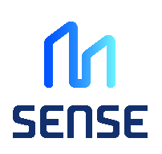

The **Citiverse** extends Local Digital Twins into immersive, citizen-centric environments, blending metaverse technologies with urban data and services.  
These initiatives promote participatory governance, citizen engagement, and innovative service design.  

## LDT CitiVERSE EDIC  

{ width="280" align="center" }  
---  

**Short Description:**  
EDICs (European Digital Infrastructure Consortiums) are instruments made available to European Member States to speed up and simplify the setup and implementation of multi-country projects.  
The LDT CitiVERSE EDIC aims to build a shared European Digital Infrastructure and an ecosystem of services and innovators that accelerate the adoption and deployment of networked, interoperable, and reusable Local Digital Twins (LDTs) in European cities, communities, and regions.  

Based in Valencia (Spain), it currently involves 14 European Member States. Local and regional authorities can also become members.  

**Key role in the LDT Ecosystem:**  
As an official European Commission body, the LDT CitiVERSE EDIC will be the reference in deploying digital twins in Europe. It:  
- Maintains, develops, and provides members with the LDT Toolbox.  
- Co-creates training materials to directly support cities and communities.  
- Federates EU actors at national, regional, and local levels.  
- Labels and reassembles an ecosystem of service providers who advise, deploy, and assess interoperability, adding value to the ecosystem.  

**Relevance to LDT4SSC:**  
- Acts as a promoter of LDT4SSC activities.  
- Provides a policy-relevant link at EU level.  

**Key Assets and Resources:**  
[[EDIC Overview](https://digital-strategy.ec.europa.eu/en/policies/edic), [CitiVERSE Factpage](https://digital-strategy.ec.europa.eu/en/factpages/citiverse)] 

**Webpage / Reference Link:**  
[https://digital-strategy.ec.europa.eu/en/factpages/citiverse](https://digital-strategy.ec.europa.eu/en/factpages/citiverse)  

**Main contact point:**  
- **Ernesto Faubel**, Chair of the EDIC — faubel@valencia.es  

---

## X-Cite – Cross-Domain Digital Twin Ecosystem for Smart Cities  

{ width="160" align="center" }  
---  

**Short Description:**  
X-Cite is a European initiative focused on developing a cross-domain digital twin ecosystem for smart cities and communities. It creates a unified, interoperable, and scalable framework for LDTs, enabling seamless integration of urban data, AI models, and simulation tools across mobility, energy, environment, and public services.  

X-Cite aligns with EU policies (Digital Decade 2030, Data Governance Act, Green Deal) and supports EU standards (Gaia-X, FIWARE, NGSI-LD). It serves as a reference ecosystem for cities, businesses, and researchers, offering tools, methodologies, and best practices to accelerate adoption of LDTs in a standardized, ethical, and compliant way.  

**Key role in the LDT Ecosystem:**  
X-Cite supports the ecosystem by:  
- Providing a cross-domain framework for interoperable LDTs.  
- Supporting municipalities through standardized methodologies, governance models, and compliance guidelines.  
- Facilitating collaboration between public administrations, businesses, and researchers.  
- Ensuring alignment with EU data spaces (Gaia-X, FIWARE) and regulations (Data Governance Act, AI Act).  

**Relevance to LDT4SSC:**  
- Cross-Domain LDT Framework: Unified integration of mobility, energy, environment, and public services.  
- Standardized Methodologies and Tools: For data integration, AI modelling, and simulation.  
- Governance and Compliance: Ensures alignment with EU rules (Data Governance Act, AI Act, GDPR).  
- Real-World Pilots: Offers testing and validation environments for scalability and replicability.  
- Interoperability: Facilitates integration with EU data spaces for scalable deployments.  

**Key Assets and Resources:**  
[[Project website](https://xcitecitiverse.eu/), [Pilots](https://xcitecitiverse.eu/pilots/)] 

**Webpage / Reference Link:**  
[https://xcitecitiverse.eu/](https://xcitecitiverse.eu/)  

**Main contact point:**  
- contact@xcitecitiverse.eu  

---

## 3Dxverse – 3D Digital Twin Platform for Smart Cities and Industrial Applications  

{ width="200" align="center" }  
---  

**Short Description:**  
3Dxverse is a cutting-edge 3D digital twin platform designed to enable realistic, interactive, and scalable 3D simulations for smart cities, industrial applications, and LDTs. It provides tools, APIs, and frameworks to create, visualize, and analyze complex 3D environments, integrating geospatial data, IoT sensors, and AI-driven analytics.  

Aligned with EU strategies (Digital Decade 2030, Green Deal), 3Dxverse supports interoperability with EU data spaces (Gaia-X, FIWARE, NGSI-LD).  

**Key role in the LDT Ecosystem:**  

3Dxverse supports the ecosystem by:  
- Providing a 3D simulation platform for urban systems and infrastructure.  
- Supporting cross-domain integration (mobility, energy, environment, urban planning).  
- Ensuring interoperability with EU data spaces and compliance with EU rules (GDPR, Data Governance Act).  
- Facilitating collaboration between cities, researchers, and businesses.  

**Relevance to LDT4SSC:**  
- 3D Digital Twin Platform: Enables visualization, analysis, and decision-making for LDTs.  
- Cross-Domain Integration: Incorporates multiple urban data layers.  
- Interoperability: Ensures replicability across Europe with EU standards.  
- Real-World Pilots: Supports testing and validation in realistic 3D settings.  
- AI & IoT Integration: Adds real-time monitoring and predictive modelling.  

**Key Assets and Resources:**  
[[Library](https://www.3dxverse.eu/library.html), [News and Events](https://www.3dxverse.eu/news-events.html)  ]

**Webpage / Reference Link:**  
[https://www.3dxverse.eu/](https://www.3dxverse.eu/)  

**Main contact point:**  
- contact@3dxverse.org 

---

## CU – European Citiverses Uniting for Inclusiveness  

{ width="220" align="center" }  
---  

**Short Description:**  
CU (Citiverses Uniting) is a European initiative that seeks to lower thresholds for urban accessibility. Grounded in universal design principles, CU develops immersive, human-centric digital experiences that allow everyone—including marginalized groups—to plan and navigate city visits safely and independently on their own devices.  

By connecting people, places, and services through a new digital layer in urban life, CU sets new accessibility and inclusiveness standards across Europe.  

**Key role in the LDT Ecosystem:**  
CU contributes to the LDT4SSC ecosystem by:  
- Gathering Insights: Mapping urban accessibility needs and integrating marginalized voices through universal design frameworks.  
- Immersive Pre-Visits: Creating digital twin–based “pre-visit” experiences that allow individuals to familiarize themselves with urban environments.  
- Universal Design: Embedding human-centric, inclusive approaches into LDTs.  
- European Awareness: Raising stakeholder-wide visibility and awareness of accessibility challenges.  
- Policy Alignment: Supporting EU priorities such as the Digital Decade 2030 and the European Accessibility Strategy.  

**Relevance to LDT4SSC:**  
- Accessibility Innovation: Places inclusiveness at the core of digital twin development.  
- Human-Centric Pilots: Bridges digital and physical accessibility in cities and communities.  
- Cross-Domain Relevance: Extends accessibility into mobility, environment, culture, and social services.  
- Scalable Impact: Provides a replicable model for cities across Europe.  

**Key Assets and Resources:**  
[[Events](https://cu-project.eu/event-calendar), [News](https://cu-project.eu/news), [Video Library](https://cu-project.eu/vimeo-library)]  

**Webpage / Reference Link:**  
[https://cu-project.eu/](https://cu-project.eu/)  

**Main contact point:**
- **Anna Wennblad**, Project Leader – Lindholmen Science Park AB
  anna.wennblad@lindholmen.se

---

## SENSE – Strengthening Cities and Enhancing Neighbourhood Sense of Belonging

{ width="100" align="center" }
---

**Short Description:**
SENSE is a European initiative funded under the Digital Europe Programme (Grant Agreement No. 101167948) that creates interconnected virtual worlds mirroring real cities using VR/AR and metaverse technologies. It aims to enhance urban life and foster a sense of citizen belonging across Europe by developing practical digital tools that connect people, places, and services. SENSE builds immersive virtual environments enabling citizens to navigate, interact, and collaborate in urban spaces, enhancing the social, architectural, green, and cultural dimensions of living spaces.

The project brings together 11+ partners including municipal authorities (Kiel, Cartagena), technology companies, and academic institutions (University of Galway), ensuring real-world grounding and cross-border transferability.

**Key role in the LDT Ecosystem:**
SENSE contributes to the LDT ecosystem by:  
- Extending Local Digital Twins into immersive, citizen-facing virtual environments.  
- Integrating EU data infrastructure with interoperability-compliant technical standards.  
- Providing a CitiVerse platform component linking urban data with participatory digital experiences.  
- Bridging smart city infrastructure and citizen engagement through accessible metaverse tooling.  

**Relevance to LDT4SSC:**    
The initiative contributes directly to LDT4SSC by:  
- Demonstrating how LDTs can be extended into citizen-centric immersive environments.  
- Providing tested frameworks for participatory urban governance via virtual worlds.  
- Offering a replicable model for cities seeking to integrate VR/AR into their digital twin stack.  

**Key Assets and Resources:**
[[Project Website](https://senseverse.eu), [Contact](https://senseverse.eu/contact-us/)]

**Webpage / Reference Link:**
[https://senseverse.eu](https://senseverse.eu)

**Main contact point:**
- [https://senseverse.eu/contact-us/](https://senseverse.eu/contact-us/)

---

## ITU Global Initiative on Virtual Worlds – Discovering the Citiverse

{ width="100" align="center" }
---

**Short Description:**
The Global Initiative on Virtual Worlds and AI is a multistakeholder platform launched by the International Telecommunication Union (ITU), the UN International Computing Centre (UNICC), and Digital Dubai, supported by over 70 international partners. It aims to shape a future where AI-powered virtual worlds are inclusive, trusted, and interoperable — connecting people, cities, and technologies to empower meaningful progress.

The initiative has produced a Citiverse Use-Case Taxonomy series covering urban planning, public safety, transport, economic development, and accessibility, and organises annual events including the UN Virtual Worlds Day and the Citiverse Assembly.

**Key role in the LDT Ecosystem:**  
The ITU initiative supports the LDT ecosystem by:  
- Providing a global governance and standards framework for AI-powered virtual worlds and citiverses.  
- Publishing practical use-case taxonomies that inform LDT deployment across urban domains.  
- Promoting inclusiveness and accessibility as core design principles for digital twin environments.  
- Connecting national and local actors through a trusted, UN-backed multistakeholder platform.  

**Relevance to LDT4SSC:**  
The initiative contributes directly to LDT4SSC by:  
- Offering a global reference framework for Citiverse standards and interoperability.  
- Providing use-case taxonomies (urban planning, mobility, public safety) directly relevant to pilot activities.  
- Supporting talent development through grants and training programmes for cities in developing contexts.  

**Key Assets and Resources:**
[[Citiverse Use-Case Taxonomy series](https://www.itu.int/epublications/en/publication/citiverse-use-case-taxonomy-global-insights-and-implementation-pathways), [Virtual Worlds Toolkit](https://www.itu.int/metaverse/virtual-worlds/virtual-worlds-toolkit/), [UN Citiverse Challenge](https://www.itu.int/metaverse/virtual-worlds/1st-un-citiverse-challenge/)]

**Webpage / Reference Link:**
[https://www.itu.int/metaverse/virtual-worlds/](https://www.itu.int/metaverse/virtual-worlds/)

**Main contact point:**
- **Ms Cristina Bueti**, Counsellor — virtualworlds@itu.int
