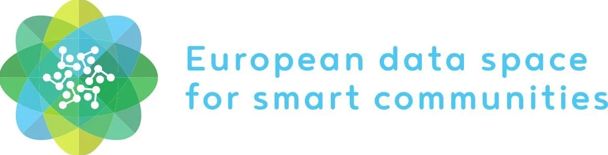
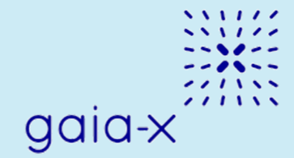

**Data Spaces** are collaborative ecosystems that enable secure and trusted sharing of data across sectors and domains.  
They provide the backbone for connecting digital twins across cities, regions, and sectors, supporting scalable pilots and long-term sustainability of the ecosystem.  

## DS4SSCC

{ width="300" align="center" }
---

**Short Description:**  
DS4SSCC (Data Space for Smart and Sustainable Cities and Communities) is a flagship EU initiative aimed at establishing a **federated, territorial, and cross-sectoral data space** for smart and sustainable cities and communities. It aligns with the **European Green Deal** and **Digital Decade** objectives, focusing on **data governance, interoperability, and shared value creation**.  

It develops a **multi-stakeholder governance scheme** (quadruple helix: public, private, academic, citizens) and a **European data space blueprint** covering technical, organizational, and legal frameworks. The blueprint is validated through **10–12 cross-sectoral pilots** in EU communities, using high-value datasets.  

The initiative also promotes **data reuse** and minimizes infrastructure investment by:  
- Co-creating use cases and functional requirements.  
- Developing **technical standards** (MIMs, DCAT, FIWARE).  
- Establishing **governance frameworks** (code of conduct, participation agreements).  
- Deploying **local pilots** to refine the blueprint.  
- Offering a **Training Hub** for data space newcomers.  

**Key role in the LDT Ecosystem:**  
DS4SSCC enables Local Digital Twins (LDTs) by providing:  
- A **federated data infrastructure** for secure, sovereign, and interoperable data sharing.  
- **Standardized data models** (MIMs, Smart Data Models, FIWARE) essential for LDTs and urban platforms.  
- **Multi-stakeholder governance frameworks** aligned with EU values.  
- Tools to support the **green and digital transition**, including tracking and reporting toward carbon neutrality and sustainable mobility.  

**Relevance to LDT4SSC:**  
The initiative contributes directly to LDT4SSC by:  

- Offering the [DS4SSCC Toolbox](https://toolbox.dssc.eu/) and Training Hub for cities deploying LDTs.  
- Providing the **technical and organizational blueprint** ([DS4SSCC Blueprint](https://www.ds4sscc.eu/inventory)) to create local data spaces that connect to LDTs.  
- Enabling pilots to generate **standardized datasets** reusable by LDTs for simulations and analytics.  
- Ensuring **legal and ethical compliance** through governance frameworks and codes of conduct.  
- Reducing **costs and carbon footprints** by promoting data reuse and shared infrastructure.  

**Key Assets and Resources:**  
[DS4SSCC Toolbox](https://toolbox.dssc.eu/), [DS4SSCC Blueprint](https://www.ds4sscc.eu/inventory), [Reports](https://www.ds4sscc.eu/reports), [Data Cooperation Canvas](https://inventory.ds4sscc.eu/multi-stakeholder-governance/developing-multi-stakeholder)]  

**Webpage / Reference Link:**  
[https://www.ds4sscc.eu](https://www.ds4sscc.eu)  

**Main contact point:**  
- Sophie Mezsaros (DS4SSCC Project Coordinator)  
- General contact: support@ds4sscc.eu  

## SIMPL 

{ width="170" align="center" }
---

**Short Description:**  
SIMPL is an **open-source platform** developed by the European Commission to support the deployment of **smart infrastructure** (e.g., IoT, sensors, APIs) and digital services for public administrations.  

It provides a **modular, interoperable, and reusable** set of tools for building **smart city applications, digital twins, and data spaces**, with a strong focus on compliance with EU standards (e.g., GDPR, EIF, Data Spaces).  

Aligned with **EU policies** (Green Deal, Digital Decade, Data Strategy) and **interoperability frameworks** (EIF, NGSI-LD), SIMPL delivers a **vendor-neutral, open-source platform** ensuring:  
- Compliance with EU regulations (e.g., GDPR, Data Governance Act).  
- Reusability and scalability of smart infrastructure solutions across Europe.  
- Cross-domain interoperability (mobility, energy, environment).  

**Key role in the LDT Ecosystem:**  
SIMPL is a **key enabler for Local Digital Twins (LDTs) and data spaces** by:  
- Providing a **modular, open-source platform** that feeds LDTs with real-time, interoperable data.  
- Ensuring **compliance with EU standards** (GDPR, EIF, NGSI-LD), reducing legal and technical barriers for LDT deployments.  
- Supporting **cross-domain interoperability** through standardized APIs and data models.  
- Facilitating **scalability and reusability** of LDT solutions across European cities and regions.  

**Relevance to LDT4SSC:**  
The initiative contributes directly to LDT4SSC by:  

- Providing a **compliant, interoperable platform** ([SIMPL Open-Source Platform](https://code.europa.eu/simpl/simpl-open)) for smart infrastructure and digital twins.  
- **Modular Architecture:** SIMPL’s plug-and-play components (IoT connectors, APIs, dashboards) accelerate LDT deployment.  
- Ensuring compatibility with **FIWARE** and **NGSI-LD**, enabling seamless data exchange with LDTs.  
- Supporting EU-funded LDT pilots with **pre-configured modules** for data integration, visualization, and analytics.  
- Providing pilots with **documentation and support**, including installation guides, user manuals, and community support.  

**Key Assets and Resources:**  
[[SIMPL Open-Source Platform](https://code.europa.eu/simpl/simpl-open), [Installation Guide](https://code.europa.eu/simpl/simpl-open/documentation/installation-guide), [User Manual](https://code.europa.eu/simpl/simpl-open/documentation/user-manual)]  

**Webpage / Reference Link:**  
[https://code.europa.eu/simpl/simpl-open](https://code.europa.eu/simpl/simpl-open)  

**Main contact point:**  
- General Contanct: cnect-simpl@ec.europa.eu  

## GAIA-X

{ width="200" align="center" }
---

**Short Description:**  
GAIA-X is a **European initiative** aimed at creating a **federated, secure, and sovereign data infrastructure** that enables trusted data sharing and interoperability across industries and borders.  

It empowers businesses, governments, and individuals with **control over their data**, while fostering **innovation**, **compliance with European regulations** (e.g., GDPR), and the development of **data-driven ecosystems**. GAIA-X ensures **data sovereignty, transparency, and trust**, supporting the creation of **domain-specific data spaces** (e.g., health, energy, mobility, smart cities) and **cross-sectoral collaboration**.  

Through the development of **technical specifications, rules, and policies** (e.g., *Gaia-X Architecture Document, Trust Framework*), GAIA-X promotes interoperability, portability, and compliance across platforms. It supports **lighthouse projects** in mobility, energy, and health; coordinates **national Gaia-X Hubs** (Germany, France, Austria, etc.); collaborates with **EU-funded programs** (Horizon Europe, Digital Europe) and alliances (FIWARE, IDSA, BDVA); and operates the **Gaia-X Digital Clearing Houses** for compliance verification and interoperability testing.  

GAIA-X brings together **370+ members** (companies, research institutions, public bodies) from **27+ countries** with an **open-source community** driving reference implementations and standards.  

**Key role in the LDT Ecosystem:**  
GAIA-X plays a pivotal role in Local Digital Twins (LDTs) and Smart Communities by:  
- Providing a **federated data infrastructure** for secure, interoperable, and sovereign data sharing.  
- Defining **standards and compliance frameworks** (e.g., Gaia-X Trust Framework, Verifiable Credentials) for legal and ethical operation of LDTs.  
- Supporting **cross-domain data spaces** (mobility, energy, urban planning) leveraged by LDTs for simulation, optimization, and decision-making.  
- Enabling **decentralized identity and access management** (e.g., Self-Sovereign Identity, SSI) to ensure sovereignty and trust.  
- Facilitating **interoperability** between LDTs and other platforms (FIWARE, IDSA, Eclipse Dataspace Connector).  

**Relevance to LDT4SSC:**  
The initiative contributes directly to LDT4SSC through:  

- **Federated data spaces & trust frameworks**, ensuring compliance with EU regulations and enabling cross-border data flows.  
- The [Gaia-X Digital Clearing House](https://gaia-x.eu/services-deliverables/digital-clearing-house/), providing verification and compliance tools for LDT data assets.  
- **Technical Standards**: Gaia-X’s reference architecture ([Gaia-X Architecture Document](https://docs.gaia-x.eu/technical-committee/architecture-document/22.10/overview/)) and specifications (e.g., Eclipse Dataspace Connector, IDSA) support secure, interoperable data pipelines.  
- **Governance & Trust**: [Gaia-X Trust Framework](https://gaia-x.eu/wp-content/uploads/2022/06/Gaia-x_Magazine_June-2022-Issue_1f.pdf) ensures ethical and compliant data sharing.  
- **Pilot Support**: [Gaia-X Lighthouse Projects](https://www.gaia-x4futuremobility.de/en/home) (e.g., mobility, energy) act as blueprints for LDT4SSC use cases.  
- **Community & Hubs**: [Gaia-X Hubs](https://gaia-x.eu/community/ecosystems/) (e.g., Germany, France) provide training and resources for cities deploying LDTs.  

**Key Assets and Resources:**  
[[Gaia-X Architecture Document](https://docs.gaia-x.eu/technical-committee/architecture-document/22.10/overview/),  [Gaia-X Digital Clearing House](https://gaia-x.eu/services-deliverables/digital-clearing-house/),  [Gaia-X Trust Framework](https://gaia-x.eu/wp-content/uploads/2022/06/Gaia-x_Magazine_June-2022-Issue_1f.pdf),  [Gaia-X Lighthouse Projects](https://www.gaia-x4futuremobility.de/en/home),  [Gaia-X Hubs](https://gaia-x.eu/community/ecosystems/),  [Architecture & Standards](https://docs.gaia-x.eu/)]  

**Webpage / Reference Link:**  
[https://gaia-x.eu/](https://gaia-x.eu/)  

**Main contact point:**  
- General contact: info@gaia-x.eu  

