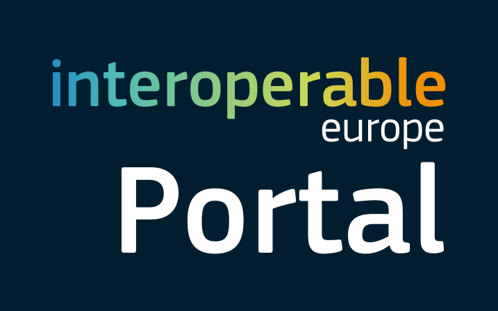

**Interoperability** ensures cities can integrate diverse digital solutions.  
Minimal Interoperability Mechanisms (MIMs) provide common standards, APIs, and governance models that allow reuse and scaling across pilots.  

## FIWARE  

{ width="300" align="center" }  
---  

**Short Description:**  
FIWARE is an open-source framework of platform components and standards designed to accelerate the development of Smart Solutions, Digital Twins, and Data Spaces. It provides a curated, interoperable, and royalty-free ecosystem for building context-aware applications across multiple domains, including smart cities, smart energy, smart agri-food, smart industry, and smart mobility.  

FIWARE enables the creation of smart digital systems based on real-time context data from IoT, sensors, and other sources. It supports data interoperability, sovereignty, and portability through open APIs and standard data models (e.g., NGSI-LD, Smart Data Models). It fosters cross-domain collaboration and the development of multi-side markets for data and services, eliminating barriers to data sharing and reuse.  

The initiative promotes innovation and digital transformation by offering reusable open-source software components (Generic Enablers), community-driven innovation (iHubs, FIWARE Academy, FIWARE Mundus), and a global developer and user community with over 200 members worldwide. It also contributes to international standardization efforts (ETSI NGSI-LD, DCAT, IDSA).  

**Key role in the LDT Ecosystem:**  
FIWARE provides the technical backbone for context data management in Local Digital Twins (LDTs), enabling real-time data integration through the FIWARE Context Broker and NGSI-LD API. It supports standardized data models and open interoperability frameworks, ensuring seamless data integration across sources.  

FIWARE also enables LDT-related data spaces with connectors (e.g., FIWARE Data Space Connector, IDSA-compliant components) and trust mechanisms such as Verifiable Credentials and blockchain-based frameworks. This facilitates cross-domain applications in energy, mobility, and urban planning.  

**Relevance to LDT4SSC:**  
FIWARE contributes directly to LDT4SSC through:  
- Context brokers, data models, and connectors used in pilots for real-time integration.  
- FIWARE Data Space Connector and Smart Data Models as core assets for building compliant data spaces.  
- Technical building blocks such as NGSI-LD API, Context Broker, and Generic Enablers.  
- Governance and trust support through verifiable credentials and trust frameworks.  
- Pilot support via FIWARE iHubs and accelerators.  
- Standardization leadership on NGSI-LD and Smart Data Models.  

**Key Assets and Resources:**  
[[FIWARE Data Space Connector](https://github.com/FIWARE/data-space-connector), [FIWARE Catalogue](https://www.fiware.org/catalogue/), [FIWARE iHubs](https://www.fiware.org/community/fiware-ihubs/), [FIWARE for Digital Twins](https://www.fiware.org/wp-content/uploads/FF_PositionPaper_FIWARE4DigitalTwins.pdf), [VCVerifier](https://github.com/FIWARE/VCVerifier), [NGSI-LD ETSI Spec](https://www.etsi.org/deliver/etsi_gs/CIM/001_099/009/01.04.02_60/gs_cim009v010402p.pdf)]  

**Webpage / Reference Link:**  
[https://www.fiware.org/](https://www.fiware.org/) | [https://github.com/FIWARE](https://github.com/FIWARE)  

**Main contact point:**  
- [Contact us](https://www.fiware.org/contact-us/)

---

## MIMs and MIMs Plus  

{ width="200" align="center" }  
---  

**Short Description:**  
Minimal Interoperability Mechanisms (MIMs) provide a baseline framework to ensure a sufficient level of interoperability for data, systems, and services in smart city solutions. Developed by OASC since 2019, MIMs are complemented by MIMs Plus, which tailors them to the European market via the Living-in.EU movement.  

They help cities, municipalities, and stakeholders share, exchange, and reuse data across urban platforms and digital services in a standardized, modular, and scalable way. The MIMs reduce fragmentation, avoid vendor lock-in, and ensure compliance with EU frameworks such as GDPR, INSPIRE, EIF, and the Data Governance Act.  

MIMs consist of two categories: foundational MIMs for core interoperability, and application-specific MIMs for particular domains.  

**Key role in the LDT Ecosystem:**  
MIMs Plus provides the minimum required specifications and standards to ensure LDTs are interoperable with city platforms, IoT systems, and data spaces. It avoids vendor lock-in, fosters reusability of digital solutions, and creates a foundation for scalable and sustainable LDTs.  

MIMs Plus also has a dedicated LDT working group and includes a specific MIM (MIM8) on Local Digital Twins interoperability.  

**Relevance to LDT4SSC:**  
- Ensures interoperability across LDT pilots.  
- Provides a framework for evaluating and guiding interoperable LDT development.  
- Aligns with EU policies and strategies (Digital Decade, Data Governance Act, Green Deal).  

**Key Assets and Resources:**  
[[MIMs Plus Specification 8.0](https://living-in.eu/sites/default/files/files/mims-plus-v.8_1.pdf), [MIMs Overview](https://oascities.org/minimal-interoperability-mechanisms/), [MIMs Adoption Guide](https://mims.oascities.org/NzWXOO1Fttw4wtqv1Wys/) ] 

**Webpage / Reference Link:**  
[MIMs – Open & Agile Smart Cities](https://oascities.org/mims/)  

**Main contact point:**  
- Sophie Meszaros, LDT MIM Lead (OASC) — sophie.meszaros@oascities.org  

---

## Interoperability Test Bed (ITB) – European Commission  

{ width="170" align="center" }  
---  

**Short Description:**  
The Interoperability Test Bed (ITB) is an open-source platform from the European Commission for testing, validating, and certifying interoperability solutions in digital public services, data spaces, and Local Digital Twins.  

It allows administrations, businesses, and developers to test compliance with EU interoperability standards (NGSI-LD, DCAT-AP, EIF, Gaia-X), validate API and data model conformance, and run both automated and manual tests. ITB also provides pre-configured test suites for smart city solutions, facilitates collaboration between EU member states and industry, and accelerates compliance with the European Interoperability Framework.  

**Key role in the LDT Ecosystem:**  
ITB is a critical resource for ensuring that LDTs comply with EU standards. It:  
- Provides structured methodologies for testing LDT interoperability.  
- Offers automated compliance checks for APIs and governance frameworks.  
- Reduces manual effort through test suites.  
- Supports cross-domain interoperability in mobility, energy, and environment.  

**Relevance to LDT4SSC:**  
- Directly applicable to pilots for testing interoperability.  
- Provides test suites for NGSI-LD, DCAT-AP, and Gaia-X.  
- Helps validate compliance with EU rules (Data Governance Act, EIF, INSPIRE).  
- Supports CI/CD pipelines with continuous testing.  
- Provides documentation, tutorials, and troubleshooting resources.  

**Key Assets and Resources:**  
[[ITB User Guide](https://www.itb.ec.europa.eu/docs/itb-ou/latest/), [ITB Platform](https://interoperable-europe.ec.europa.eu/collection/interoperability-test-bed-repository/solution/interoperability-test-bed)]

**Webpage / Reference Link:**  
[https://www.itb.ec.europa.eu/docs/itb-ou/latest/](https://www.itb.ec.europa.eu/docs/itb-ou/latest/)  

**Main contact point:**  
- DIGIT-ITB@ec.europa.eu