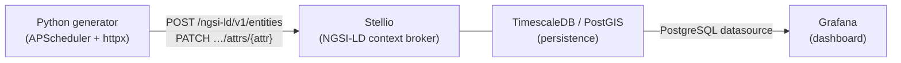

# How it works

!!! warning "This embedded demo is a browser-only mock"
    The demo runs entirely in your browser. There is no real context broker, no database, and no server. The "broker" is a JavaScript object that mimics the shape of a Stellio NGSI-LD API — all entity state is lost when you close the page. This is Track A. The real backend stack (Track B) is described below.

---

## Track A vs Track B

| | Track A — embedded demo | Track B — real stack |
|---|---|---|
| **Where it runs** | Visitor's browser (static GitHub Pages) | Your laptop (Docker) |
| **Context broker** | In-browser JS mock (`broker.js`) | [Stellio](https://stellio.readthedocs.io/) NGSI-LD context broker |
| **Persistence** | In-memory (lost on page reload) | TimescaleDB / PostGIS |
| **Data** | Synthetic (seeded from OSM + solar model) | Continuous (Python generator pushes every 10 s) |
| **Dashboards** | ECharts time-series inside this page | Grafana (provisioned automatically) |
| **Purpose** | Explore NGSI-LD concepts without any setup | Run the real thing locally |

The two tracks share the same NGSI-LD entity shape and attribute names (`rooftopArea`, `installedCapacity`, `tiltAngle`, `generatedPower`) so they stay conceptually aligned.

---

## Track B architecture

The real Docker-based stack follows this data flow:



1. **Python generator** — on startup, POSTs ~30 `Building` NGSI-LD entities. Then runs a loop (every 10 s) that PATCHes the `generatedPower` attribute on each entity with a new synthetic solar value based on the current time of day and a cloud-cover factor.
2. **Stellio** — a production-grade NGSI-LD context broker. Receives HTTP requests, validates them against the NGSI-LD spec, and persists entity state and temporal history.
3. **TimescaleDB / PostGIS** — Stellio's backing store. Time-series data (attribute observations with `observedAt`) is stored in TimescaleDB hypertables; geometry is indexed with PostGIS.
4. **Grafana** — auto-provisioned with a PostgreSQL datasource pointed at Stellio's schema. Provides a geomap panel (building locations) and a time-series panel (`generatedPower` history).

---

## Work Strand 3 framing

The embedded demo includes a **Forecast** scenario that pulls a live 7-day weather forecast from [Open-Meteo](https://open-meteo.com/) and runs it through a deterministic clear-sky solar model.

This feature is a **forecast-driven scenario simulator that illustrates the class of services WS3 could deliver** — it is not an AI service in itself. The model is a deterministic physics calculation (clear-sky irradiance modulated by cloud cover), not machine learning. The LDT4SSC Work Strand 3 scope requires significant integration of AI with clear added value over a non-AI solution.

A credible step toward a genuine WS3 service would be to add an in-browser ML model — for example, a regression layer that learns each building's idiosyncratic output curve from its historical observations and predicts forward. The demo's architecture is intentionally open to this extension.

---

## Running Track B locally

The full Docker stack lives under `demo-stack/` at the root of this repository. It is not deployed to GitHub Pages — you run it on your own machine.

```bash
cd demo-stack
docker compose up -d
```

See `demo-stack/README.md` for the 60-second quickstart, port assignments, and how to connect Grafana.
